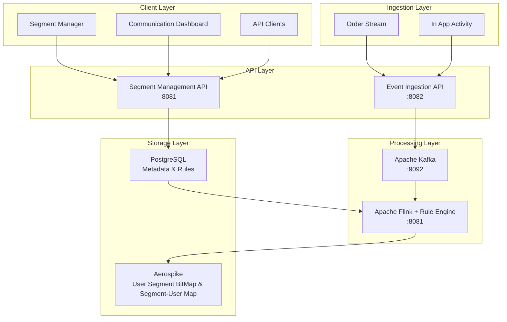

# Audience Manager Platform

A real-time audience segmentation platform built with Apache Kafka, Apache Flink, and Aerospike for high-performance user profiling and dynamic segment management.

## 🏗️ Architecture Overview



## 🚀 Quick Start

### Choose Your Environment

**Option 1: Docker Compose (Recommended for Development)**
- Requires: Docker & Docker Compose
- Resources: ~6GB RAM
- Setup time: 5-10 minutes

**Option 2: Kubernetes Demo (Recommended for Demo/Training)**
- Requires: Rancher Desktop with 8GB allocation
- Resources: Exactly 8GB RAM
- Setup time: 10-15 minutes
- Full production-like architecture

### Option 1: Docker Compose Setup

#### Prerequisites
- **Java 17+**
- **Maven 3.8+**
- **Docker & Docker Compose**

#### 1. Environment Setup

```bash
# Clone and navigate to the project
cd audience-manager

# Start all infrastructure services
./audience-manager-infrastructure/scripts/setup-environment.sh
```

This will start:
- Kafka & Zookeeper
- Aerospike database
- Aerospike namespaces (user_profiles, segment_ownership)
- Flink cluster
- Prometheus & Grafana monitoring

#### 2. Build the Project

```bash
# Build all modules
mvn clean install
```

#### 3. Start the Services

**Terminal 1 - Segment Management API**
```bash
cd audience-manager-api
mvn spring-boot:run
```

**Terminal 2 - Event Ingestion API**
```bash
cd audience-manager-ingestion
mvn spring-boot:run -Dspring-boot.run.arguments=--server.port=8082
```

**Terminal 3 - Deploy Flink Job**
```bash
./audience-manager-infrastructure/scripts/deploy-flink-job.sh
```

### Option 2: Kubernetes Demo Setup

#### Prerequisites
- **Rancher Desktop** with 8GB memory allocation
- **kubectl** configured for rancher-desktop context

#### 1. Deploy Demo Environment

```bash
# Deploy complete Kubernetes environment
kubectl apply -f kube-config/deployment-specs/

# Wait for all pods to be ready
kubectl wait --for=condition=ready pod --all -n audience-manager-demo --timeout=300s

# Verify deployment
kubectl get pods -n audience-manager-demo
```

#### 2. Access Demo Services

All services are available via NodePort on localhost:

- **Segment API**: http://localhost:30081
- **Ingestion API**: http://localhost:30082  
- **Grafana**: http://localhost:30001 (admin/demo123)
- **Kafka UI**: http://localhost:30080
- **Flink Dashboard**: http://localhost:30881

📖 **For detailed demo instructions, see**: [Demo HLD Documentation](docs/demohld/README.md)

### Verification for Both Options

- **Kafka UI**: http://localhost:8080
- **Flink Dashboard**: http://localhost:8081
- **Segment API**: http://localhost:8081/actuator/health
- **Ingestion API**: http://localhost:8082/actuator/health
- **PostgreSQL**: localhost:5432 (postgres/postgres123)
- **Aerospike**: localhost:3000 (multiple namespaces: user_profiles, segment_ownership)
- **Grafana**: http://localhost:3001 (admin/admin123)

## 📊 Project Structure

```
audience-manager/
├── docs/                                   # Production Documentation & Design
│   ├── hld/                                # High-Level Design (Production)
│   ├── lld/                                # Low-Level Design
│   ├── ai-prompts/                         # AI Development Prompts
│   └── tasks/                              # Implementation Tasks
├── demohld/                                # Demo Environment Design (8GB Kubernetes)
│   ├── deployment-specs/                   # Kubernetes YAML deployments
│   ├── demo-system-architecture.md         # Demo-specific architecture
│   ├── deployment-guide.md                 # Complete component interaction guide
│   ├── production-vs-demo-comparison.md    # Production vs Demo differences
│   └── README.md                           # Demo setup instructions
├── audience-manager-common/                # Shared models and utilities
├── audience-manager-api/                   # Segment management REST API
├── audience-manager-ingestion/             # Event ingestion service
├── audience-manager-processor/             # Flink stream processing job with integrated rule engine
└── audience-manager-infrastructure/        # Docker & configuration files
    ├── docker/                             # Docker Compose setup
    ├── configs/                            # Service configurations
    └── scripts/                            # Management scripts
```

## 🔧 Development Workflow

### Creating a New Segment

```bash
curl -X POST http://localhost:8081/api/segments \
  -H "Content-Type: application/json" \
  -d '{
    "name": "High Value Users",
    "type": "DYNAMIC",
    "rules": {
      "conditions": [
        {"field": "totalSpent", "operator": "gt", "value": 1000}
      ]
    }
  }'
```

### Sending User Events

```bash
curl -X POST http://localhost:8082/api/events \
  -H "Content-Type: application/json" \
  -d '{
    "userId": "user123",
    "eventType": "purchase",
    "properties": {
      "amount": 1500,
      "category": "electronics"
    }
  }'
```

## 🛠️ Technology Stack

| Component | Technology | Purpose |
|-----------|------------|---------|
| **API Framework** | Spring Boot 3.2 | REST APIs and microservices |
| **Message Queue** | Apache Kafka 3.5 | Event streaming and messaging |
| **Stream Processing** | Apache Flink 1.17 | Real-time data processing with integrated rule engine |
| **User Storage & Cache** | Aerospike 6.4 | High-performance user profiles, sessions & caching |
| **Metadata Store** | PostgreSQL 15 | Segment definitions, rules & metadata |
| **Communication** | SendGrid / Amazon SES | Email delivery and tracking |
| **Monitoring** | Prometheus + Grafana | Metrics and dashboards |
| **Build Tool** | Maven 3.8+ | Dependency management |

## 📈 Monitoring & Operations

### Key Metrics Dashboards

- **System Health**: http://localhost:3001/d/system-overview
- **Kafka Metrics**: http://localhost:3001/d/kafka-overview
- **Flink Job Metrics**: http://localhost:3001/d/flink-overview
- **API Performance**: http://localhost:3001/d/api-overview

### Log Locations

- **API Logs**: `audience-manager-api/logs/`
- **Ingestion Logs**: `audience-manager-ingestion/logs/`
- **Flink Logs**: Available in Flink UI → Task Manager → Logs

## 🧪 Testing

```bash
# Run all tests
mvn test

# Run tests for specific module
mvn test -pl audience-manager-api

# Integration tests (requires running infrastructure)
mvn verify -Pintegration-tests
```

## 🔄 Cleanup

```bash
# Stop all services and clean up
./audience-manager-infrastructure/scripts/cleanup-environment.sh
```

## 📖 Documentation

- **[System Architecture](docs/hld/system-architecture.md)** - High-level system design
- **[API Documentation](docs/lld/api-design.md)** - REST API reference
- **[Development Guide](docs/tasks/implementation-tasks.md)** - Step-by-step development tasks
- **[Infrastructure Setup](audience-manager-infrastructure/README.md)** - Detailed infrastructure guide

## 🤝 Contributing

1. Read the [Development Guide](docs/tasks/implementation-tasks.md)
2. Check existing [AI Prompts](docs/ai-prompts/) for context
3. Follow the established project structure
4. Add tests for new features
5. Update documentation as needed

## 📄 License

This project is a POC (Proof of Concept) for demonstration purposes.

---

🎯 **Ready to build real-time audience segments at scale!**