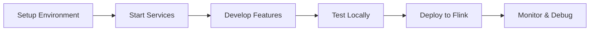

# Audience Manager Platform Documentation

This directory contains comprehensive documentation for the Audience Manager platform.

## Documentation Structure

### 📋 High-Level Design (HLD)
- [System Architecture](hld/system-architecture.md) - **Production Architecture**
- [Component Overview](hld/component-overview.md)
- [Data Flow](hld/data-flow.md)
- [Technology Stack](hld/technology-stack.md)

### 🎯 Demo Environment Design
- [Demo HLD Overview](demohld/README.md) - **Single-machine Kubernetes setup**
- [Demo System Architecture](demohld/demo-system-architecture.md) - **8GB optimized design**
- [Deployment Guide](demohld/deployment-guide.md) - **Component interactions**
- [Production vs Demo Comparison](demohld/production-vs-demo-comparison.md)

### 🔧 Low-Level Design (LLD)
- [API Design](lld/api-design.md)
- [Database Schema](lld/database-schema.md)
- [Message Formats](lld/message-formats.md)
- [Flink Job Design](lld/flink-job-design.md)

### 🤖 AI Prompts & Tasks
- [Development Prompts](ai-prompts/development-prompts.md)
- [Architecture Decisions](ai-prompts/architecture-decisions.md)
- [Implementation Tasks](tasks/implementation-tasks.md)

## Quick Start

1. **Environment Setup**: Follow the [setup guide](../audience-manager-infrastructure/scripts/setup-environment.sh)
2. **Architecture Overview**: Start with [System Architecture](hld/system-architecture.md)
3. **API Reference**: Check [API Design](lld/api-design.md) for endpoint details
4. **Development**: Review [Implementation Tasks](tasks/implementation-tasks.md)

## Project Overview

The Audience Manager platform is a real-time audience segmentation system that:

- 🎯 **Creates Dynamic Segments**: Build rules-based audience segments
- 📊 **Processes Live Data**: Ingest and process real-time user events
- ⚡ **Real-time Processing**: Use Apache Flink for stream processing
- 🏪 **High-Performance Storage**: Store user profiles in Aerospike
- 📈 **Monitoring**: Comprehensive monitoring with Prometheus and Grafana

## Components

| Component | Purpose | Technology |
|-----------|---------|------------|
| **API Service** | Segment management and metadata operations | Spring Boot |
| **Ingestion Service** | Real-time event ingestion | Spring Boot + Kafka |
| **Stream Processor** | Real-time segment tagging | Apache Flink |
| **Infrastructure** | Supporting services and monitoring | Docker, Kafka, Aerospike, PostgreSQL |

## Development Workflow

For detailed development instructions, see the individual component documentation and the tasks directory.