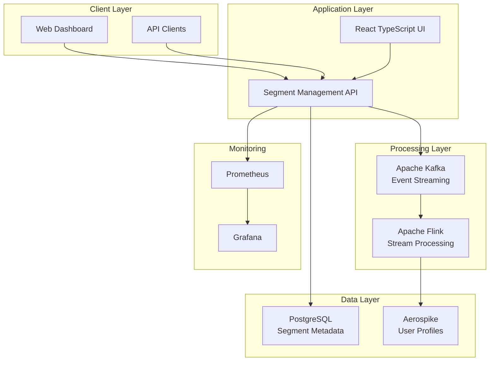
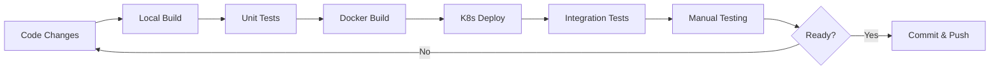

# Audience Manager Platform Documentation

## Overview

This directory contains comprehensive documentation for the Audience Manager Platform, a distributed real-time audience segmentation system designed for enterprise-scale marketing automation.

## Documentation Structure

### 📋 [High-Level Design (HLD)](./high-level-design.md)
**Comprehensive system design and architecture document**

**Contents:**
- System overview and capabilities
- Functional and non-functional requirements
- System entities and data models
- Distributed architecture design
- Component interactions and data flows
- Scalability and security considerations
- API design and error handling
- Performance benchmarks and future enhancements

**Audience:** System architects, senior developers, product managers

---

### 🏗️ [Infrastructure Specification](./infrastructure-specification.md)
**Detailed Kubernetes infrastructure and deployment guide**

**Contents:**
- Kubernetes cluster configuration
- Application service deployments
- Data services (PostgreSQL, Aerospike)
- Messaging and stream processing (Kafka, Flink)
- Monitoring and observability (Prometheus, Grafana)
- Security configuration and RBAC
- Resource management and scaling
- Backup and disaster recovery procedures

**Audience:** DevOps engineers, infrastructure teams, deployment specialists

---

### 🛠️ [Setup and Development Guide](./setup-and-development-guide.md)
**Complete setup instructions for local development and testing**

**Contents:**
- Prerequisites and system requirements
- Step-by-step build process
- Local development workflow
- Kubernetes deployment procedures
- Debugging and troubleshooting
- Data management and testing
- IDE configuration
- Maintenance and cleanup procedures

**Audience:** Developers, QA engineers, new team members

---

## Quick Start

For immediate setup and deployment:

1. **Read Prerequisites**: Check [Setup Guide Section 2](./setup-and-development-guide.md#2-prerequisites)
2. **Clone and Build**: Follow [Setup Guide Section 4-5](./setup-and-development-guide.md#4-initial-setup)
3. **Deploy Infrastructure**: Use [Setup Guide Section 6](./setup-and-development-guide.md#6-infrastructure-deployment)
4. **Access Application**: Visit http://localhost:30280

## Architecture Summary

## Key Features

### ✅ **Current Implementation**
- **Segment Management**: Create and manage independent/derived audience segments
- **Real-time API**: RESTful API with OpenAPI documentation
- **Modern UI**: React TypeScript with Material-UI design
- **Kubernetes Deployment**: Containerized microservices architecture
- **Monitoring**: Prometheus metrics and Grafana dashboards
- **Data Storage**: PostgreSQL for metadata, Aerospike for profiles

### 🚀 **Production Ready Features**
- **Distributed Architecture**: Horizontal scaling across multiple nodes
- **Event Streaming**: Kafka-based event processing pipeline
- **Stream Processing**: Flink jobs for real-time segment evaluation
- **High Availability**: Multi-replica deployments with auto-scaling
- **Security**: RBAC, network policies, and data encryption
- **Observability**: Distributed tracing and centralized logging

## Technology Stack

| Layer | Technology | Purpose |
|-------|------------|---------|
| **Frontend** | React 18, TypeScript, Material-UI | User interface |
| **Backend** | Spring Boot 2.7, Java 11 | REST API services |
| **Databases** | PostgreSQL 15, Aerospike CE | Data persistence |
| **Messaging** | Apache Kafka 7.4 | Event streaming |
| **Processing** | Apache Flink 1.18 | Stream processing |
| **Monitoring** | Prometheus, Grafana | Observability |
| **Orchestration** | Kubernetes 1.27+ | Container management |
| **Build Tools** | Maven 3.9, npm 9 | Build automation |

## Development Workflow

## API Endpoints

### Core Segment Management
- `POST /api/v1/segments` - Create segment
- `GET /api/v1/segments` - List segments  
- `GET /api/v1/segments/{id}` - Get segment details
- `PUT /api/v1/segments/{id}` - Update segment
- `DELETE /api/v1/segments/{id}` - Delete segment

### Health and Monitoring
- `GET /api/v1/segments/health` - Health check
- `GET /actuator/health` - Spring Boot health
- `GET /actuator/prometheus` - Metrics endpoint

## Support and Troubleshooting

### Common Issues
1. **Pod CrashLoopBackOff**: Check resource limits and logs
2. **Database Connection**: Verify service endpoints and credentials
3. **Build Failures**: Ensure Java 11 and Node 18+ are installed
4. **UI Not Loading**: Check Nginx proxy configuration

### Getting Help
- **Setup Issues**: See [Troubleshooting Section](./setup-and-development-guide.md#10-debugging-and-troubleshooting)
- **Architecture Questions**: Review [HLD Document](./high-level-design.md)
- **Infrastructure Problems**: Check [Infrastructure Spec](./infrastructure-specification.md)
- **Performance Issues**: Monitor via Grafana at http://localhost:30001

## Contributing

### Documentation Updates
1. Update the relevant document (HLD, Infrastructure, or Setup Guide)
2. Ensure accuracy with current implementation
3. Update version numbers and dates
4. Test all setup instructions
5. Submit pull request with clear description

### Code Changes
1. Follow the development workflow in the [Setup Guide](./setup-and-development-guide.md#9-development-workflow)
2. Update documentation to reflect changes
3. Ensure all tests pass
4. Update API documentation if needed

---

## Document Metadata

| Document | Last Updated | Version | Status |
|----------|--------------|---------|--------|
| High-Level Design | 2025-01-07 | 1.0 | ✅ Current |
| Infrastructure Specification | 2025-01-07 | 1.0 | ✅ Current |
| Setup and Development Guide | 2025-01-07 | 1.0 | ✅ Current |

For questions or suggestions, please refer to the appropriate document section or create an issue in the project repository.