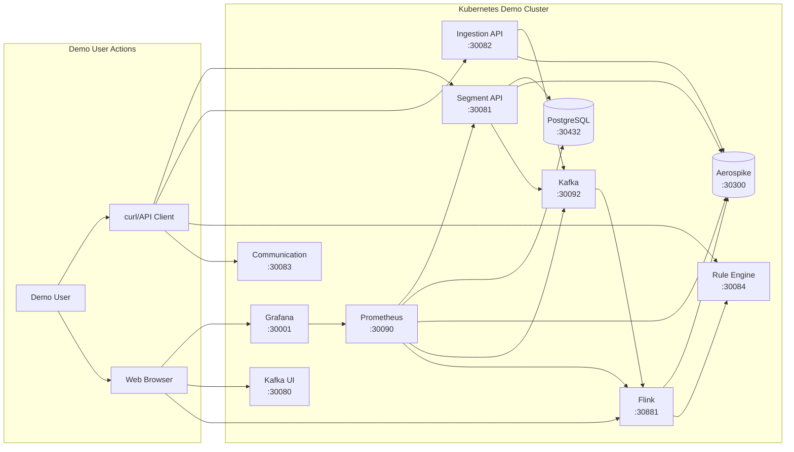

# Demo High-Level Design - Audience Manager Platform

## 🎯 Overview

This folder contains the **Demo High-Level Design** for the Audience Manager Platform, specifically optimized for **single-machine deployment** using **Rancher Desktop Kubernetes** with **8GB total memory allocation**. This setup is perfect for development, testing, and demonstration purposes.

> **📝 Note**: This is a **demo configuration**. For production deployments, refer to the main [HLD documentation](../hld/system-architecture.md).

## 📁 Folder Structure

```
demohld/
├── README.md                          # This file - demo overview and instructions
├── demo-system-architecture.md        # Complete demo architecture documentation
├── deployment-specs/                  # Kubernetes deployment specifications
│   ├── namespace.yaml                 # Demo namespace creation
│   ├── postgres-deployment.yaml       # PostgreSQL database (512MB)
│   ├── aerospike-deployment.yaml      # Aerospike cache cluster (1GB)
│   ├── kafka-deployment.yaml          # Kafka + Zookeeper (1.5GB)
│   ├── flink-deployment.yaml          # Flink processing (1.5GB)
│   └── monitoring-deployment.yaml     # Prometheus + Grafana + Kafka UI (1GB)
├── diagrams/                          # Architecture diagrams (auto-generated)
└── monitoring/                        # Monitoring configurations
```

## 🚀 Quick Start Guide

### Prerequisites

1. **Rancher Desktop** installed and configured with **8GB memory allocation**
2. **kubectl** configured to use rancher-desktop context
3. **curl** or similar tool for API testing

### Step 1: Verify Environment

```bash
# Verify Rancher Desktop is running
kubectl config current-context
# Should return: rancher-desktop

# Check available resources
kubectl top nodes
# Should show ~8GB total memory
```

### Step 2: Deploy the Demo Platform

```bash
# Navigate to project root
cd /path/to/audience-manager

# Deploy all components
kubectl apply -f demohld/deployment-specs/

# Verify deployment
kubectl get pods -n audience-manager-demo --watch
```

### Step 3: Wait for All Services

```bash
# Wait for all pods to be ready (may take 3-5 minutes)
kubectl wait --for=condition=ready pod --all -n audience-manager-demo --timeout=300s

# Check service status
kubectl get services -n audience-manager-demo
```

### Step 4: Verify Access Points

```bash
# Test all external endpoints
curl http://localhost:30081/actuator/health  # Segment API
curl http://localhost:30082/actuator/health  # Ingestion API (when deployed)
curl http://localhost:30084/actuator/health  # Rule Engine (when deployed)
curl http://localhost:30083/actuator/health  # Communication API (when deployed)

# Open monitoring dashboards
open http://localhost:30001  # Grafana (admin/demo123)
open http://localhost:30080  # Kafka UI
open http://localhost:30881  # Flink Dashboard
```

## 📊 Resource Allocation Summary

| Component | Memory | CPU | NodePort | Purpose |
|-----------|--------|-----|----------|---------|
| **PostgreSQL** | 512MB | 0.5 cores | 30432 | Metadata storage |
| **Aerospike** | 1GB | 1.0 cores | 30300 | Cache & user data |
| **Kafka + Zookeeper** | 1.5GB | 1.5 cores | 30092 | Message streaming |
| **Flink (JM + TM)** | 1.5GB | 2.5 cores | 30881 | Stream processing |
| **Prometheus** | 512MB | 0.5 cores | 30090 | Metrics collection |
| **Grafana** | 512MB | 0.5 cores | 30001 | Monitoring dashboards |
| **Kafka UI** | 256MB | 0.5 cores | 30080 | Kafka management |
| **API Services** | 2GB | 4.0 cores | 30081-30084 | Application APIs |
| **System Overhead** | ~500MB | 1.0 cores | - | Kubernetes & OS |
| **TOTAL** | **8GB** | **12 cores** | - | **Complete platform** |

## 🔧 Component Interactions

### Data Flow in Demo Environment



## 🎮 Demo Scenarios

### Scenario 1: Basic Platform Demo

```bash
# 1. Create a demo segment
curl -X POST http://localhost:30081/api/segments \
  -H "Content-Type: application/json" \
  -d '{
    "name": "Demo High Value Users",
    "type": "DYNAMIC",
    "rules": {
      "conditions": [
        {"field": "totalSpent", "operator": "gt", "value": 500}
      ]
    }
  }'

# 2. Send sample events
curl -X POST http://localhost:30082/api/events \
  -H "Content-Type: application/json" \
  -d '{
    "userId": "demo-user-001",
    "eventType": "purchase",
    "properties": {
      "amount": 750,
      "category": "electronics"
    }
  }'

# 3. Check segment membership
curl http://localhost:30084/api/users/demo-user-001/segments
```

### Scenario 2: Monitoring Demo

```bash
# 1. Open Grafana dashboard
open http://localhost:30001
# Login: admin / demo123

# 2. View Kafka topics
open http://localhost:30080

# 3. Monitor Flink jobs
open http://localhost:30881

# 4. Check resource usage
kubectl top pods -n audience-manager-demo
```

### Scenario 3: Performance Testing

```bash
# Generate load with multiple events
for i in {1..100}; do
  curl -X POST http://localhost:30082/api/events \
    -H "Content-Type: application/json" \
    -d "{\"userId\": \"user-$i\", \"eventType\": \"pageview\", \"properties\": {\"page\": \"/home\"}}"
done

# Monitor performance in Grafana
open http://localhost:30001/d/demo-performance
```

## 📈 Performance Expectations

### Demo Environment Limitations

| Metric | Demo Target | Production Target | Constraint |
|--------|-------------|-------------------|------------|
| **Event Throughput** | 100-500 events/sec | 50,000+ events/sec | Single Kafka partition |
| **API Latency** | < 500ms | < 200ms | Limited CPU allocation |
| **Segment Evaluation** | < 1 second | < 100ms | Single Flink TaskManager |
| **Concurrent Users** | 10-20 | 10,000+ | Memory-limited caching |
| **Data Retention** | 6 hours | 30+ days | Storage constraints |

### Optimization for Demo

1. **Memory-First Strategy**: All data stored in memory (Aerospike, Kafka)
2. **Reduced Replication**: Single replicas for all services
3. **Short Retention**: 6-hour data retention vs production 30+ days
4. **Simplified Monitoring**: Essential metrics only
5. **No Persistence**: Data lost on restart (acceptable for demos)

## 🛠️ Troubleshooting

### Common Issues

#### 1. Pods Not Starting
```bash
# Check pod status
kubectl get pods -n audience-manager-demo

# Check pod logs
kubectl logs -n audience-manager-demo <pod-name>

# Check resource usage
kubectl top pods -n audience-manager-demo
```

#### 2. Out of Memory Errors
```bash
# Check node resources
kubectl top nodes

# Reduce memory allocation in deployment specs if needed
# Edit deployment-specs/*.yaml files and reduce memory requests/limits
```

#### 3. Service Not Accessible
```bash
# Check service endpoints
kubectl get services -n audience-manager-demo

# Verify NodePort accessibility
curl -v http://localhost:30081/actuator/health
```

### Cleanup

```bash
# Remove entire demo environment
kubectl delete namespace audience-manager-demo

# Verify cleanup
kubectl get pods -n audience-manager-demo
# Should return: No resources found
```

## 🔗 Related Documentation

- **[Main HLD](../hld/system-architecture.md)** - Production architecture
- **[Demo Architecture](demo-system-architecture.md)** - Detailed demo design
- **[Project README](../../README.md)** - Overall project documentation
- **[Docker Compose Setup](../../audience-manager-infrastructure/docker/docker-compose.yml)** - Alternative local setup

## 📞 Support

For demo-related questions:

1. Check the troubleshooting section above
2. Review component logs: `kubectl logs -n audience-manager-demo <pod-name>`
3. Monitor resource usage: `kubectl top pods -n audience-manager-demo`
4. Validate network connectivity between services

This demo environment provides a complete, functional audience management platform that showcases all core capabilities within the constraints of a single development machine! 🎯