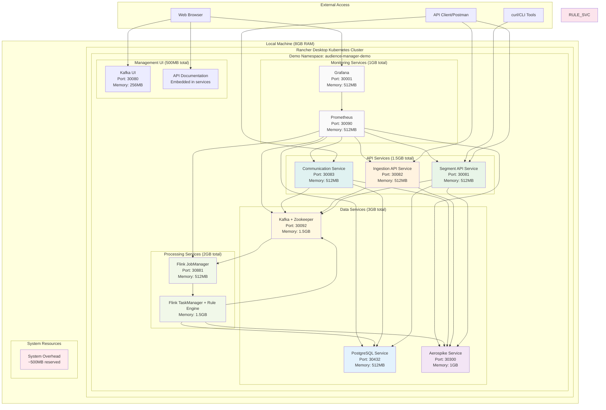
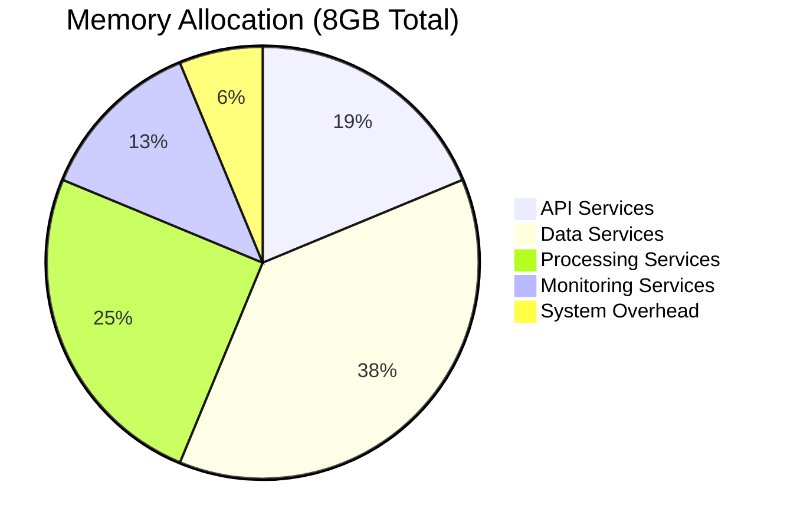
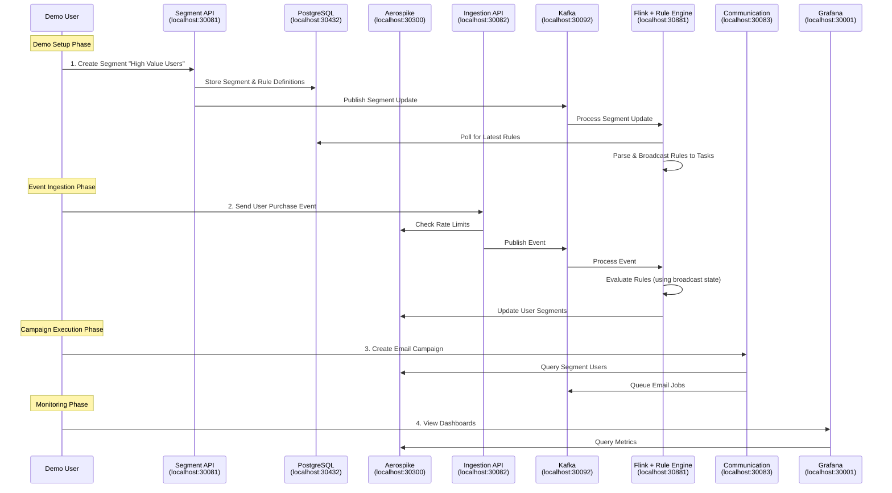

# Demo System Architecture - Audience Manager Platform

## Demo Environment Overview

This document describes the **single-machine Kubernetes deployment** of the Audience Manager Platform optimized for **demonstration and development purposes** using **Rancher Desktop** with **8GB total memory allocation**. This setup provides a fully functional audience segmentation platform while maintaining resource efficiency for local development and demo scenarios.

> **⚠️ Important**: This is a **demo configuration** designed for development, testing, and demonstration purposes. For production deployments, refer to the main [HLD](../hld/system-architecture.md) which includes multi-node clusters, high availability, and enterprise-scale resource allocation.

## Architecture Overview



## Resource Allocation Strategy (8GB Total)

### 📊 Memory Distribution Logic

The 8GB total memory is distributed based on the following prioritization:



#### 1. **API Services (1.5GB - 18.75%)**
- **Segment API**: 512MB - *Moderate load, CRUD operations*
- **Ingestion API**: 512MB - *High throughput, event processing*
- **Communication**: 512MB - *Async processing, template rendering*

**Logic**: Equal allocation among API services for balanced performance and simplicity in demo environment. Rule Engine logic moved to Flink for better performance.

#### 2. **Data Services (3GB - 37.5%)**
- **PostgreSQL**: 512MB - *Lightweight for demo data volumes*
- **Aerospike**: 1GB - *Primary cache/storage, needs memory for namespaces*
- **Kafka + Zookeeper**: 1.5GB - *Message buffering and coordination*

**Logic**: Aerospike gets highest allocation as it handles all caching and user data. Kafka gets significant memory for message buffering.

#### 3. **Processing Services (2GB - 25%)**
- **Flink JobManager**: 512MB - *Coordination and management*
- **Flink TaskManager with Integrated Rule Engine**: 1.5GB - *Stream processing + rule evaluation workload*

**Logic**: TaskManager gets increased memory allocation as it now handles both stream processing and rule evaluation, eliminating the need for a separate Rule Engine service.

#### 4. **Monitoring Services (1GB - 12.5%)**
- **Prometheus**: 512MB - *Metrics collection and storage*
- **Grafana**: 512MB - *Dashboard rendering and queries*

**Logic**: Equal allocation for monitoring components, sufficient for demo metrics.

#### 5. **System Overhead (~500MB - 6.25%)**
- Kubernetes system pods, container runtime, OS overhead

### 🔧 Kubernetes Resource Specifications

#### Resource Requests vs Limits Strategy
```yaml
# Conservative approach for demo environment
resources:
  requests:
    memory: "80% of allocated"  # Guaranteed allocation
    cpu: "0.1-0.5"             # Minimal CPU requests
  limits:
    memory: "120% of allocated" # Allow some burst
    cpu: "1.0-2.0"             # Reasonable CPU limits
```

## Component Deployment Architecture

### 🚀 Kubernetes Deployment Specifications

#### 1. **Segment Management API**
```yaml
apiVersion: apps/v1
kind: Deployment
metadata:
  name: segment-api
  namespace: audience-manager-demo
spec:
  replicas: 1
  template:
    spec:
      containers:
      - name: segment-api
        image: audience-manager/segment-api:demo
        ports:
        - containerPort: 8081
        resources:
          requests:
            memory: "400Mi"
            cpu: "0.2"
          limits:
            memory: "512Mi"
            cpu: "1.0"
        env:
        - name: SPRING_PROFILES_ACTIVE
          value: "demo"
        - name: DB_URL
          value: "postgresql://postgres-service:5432/audience_manager"
        - name: AEROSPIKE_HOSTS
          value: "aerospike-service:3000"
---
apiVersion: v1
kind: Service
metadata:
  name: segment-api-service
  namespace: audience-manager-demo
spec:
  type: NodePort
  ports:
  - port: 8081
    targetPort: 8081
    nodePort: 30081
  selector:
    app: segment-api
```

#### 2. **PostgreSQL Database**
```yaml
apiVersion: apps/v1
kind: Deployment
metadata:
  name: postgres
  namespace: audience-manager-demo
spec:
  replicas: 1
  template:
    spec:
      containers:
      - name: postgres
        image: postgres:15.5-alpine
        ports:
        - containerPort: 5432
        resources:
          requests:
            memory: "400Mi"
            cpu: "0.1"
          limits:
            memory: "512Mi"
            cpu: "0.5"
        env:
        - name: POSTGRES_DB
          value: "audience_manager"
        - name: POSTGRES_USER
          value: "postgres"
        - name: POSTGRES_PASSWORD
          value: "demo123"
        - name: PGDATA
          value: "/var/lib/postgresql/data/pgdata"
        volumeMounts:
        - mountPath: /var/lib/postgresql/data
          name: postgres-storage
      volumes:
      - name: postgres-storage
        emptyDir: {}  # For demo purposes only
---
apiVersion: v1
kind: Service
metadata:
  name: postgres-service
  namespace: audience-manager-demo
spec:
  type: NodePort
  ports:
  - port: 5432
    targetPort: 5432
    nodePort: 30432
  selector:
    app: postgres
```

#### 3. **Aerospike Configuration**
```yaml
apiVersion: apps/v1
kind: Deployment
metadata:
  name: aerospike
  namespace: audience-manager-demo
spec:
  replicas: 1
  template:
    spec:
      containers:
      - name: aerospike
        image: aerospike/aerospike-server:6.4.0.8
        ports:
        - containerPort: 3000
        - containerPort: 3001
        - containerPort: 3002
        resources:
          requests:
            memory: "800Mi"
            cpu: "0.3"
          limits:
            memory: "1Gi"
            cpu: "1.5"
        volumeMounts:
        - mountPath: /opt/aerospike/data
          name: aerospike-data
        - mountPath: /etc/aerospike/aerospike.conf
          name: aerospike-config
          subPath: aerospike.conf
      volumes:
      - name: aerospike-data
        emptyDir: {}
      - name: aerospike-config
        configMap:
          name: aerospike-config
---
apiVersion: v1
kind: ConfigMap
metadata:
  name: aerospike-config
  namespace: audience-manager-demo
data:
  aerospike.conf: |
    service {
        user root
        group root
        paxos-single-replica-limit 1
        pidfile /var/run/aerospike/asd.pid
        proto-fd-max 15000
    }
    
    logging {
        file /var/log/aerospike/aerospike.log {
            context any info
        }
        console {
            context any info
        }
    }
    
    network {
        service {
            address any
            port 3000
        }
        heartbeat {
            mode mesh
            port 3002
            address any
            interval 150
            timeout 10
        }
        fabric {
            port 3001
        }
        info {
            port 3003
        }
    }
    
    # Demo namespaces with reduced memory footprint
    namespace user_profiles {
        replication-factor 1
        memory-size 400M
        storage-engine memory
    }
    
    namespace cache {
        replication-factor 1
        memory-size 300M
        default-ttl 3600
        storage-engine memory
    }
    
    namespace analytics {
        replication-factor 1
        memory-size 200M
        storage-engine memory
    }
---
apiVersion: v1
kind: Service
metadata:
  name: aerospike-service
  namespace: audience-manager-demo
spec:
  type: NodePort
  ports:
  - name: service
    port: 3000
    targetPort: 3000
    nodePort: 30300
  - name: fabric
    port: 3001
    targetPort: 3001
  - name: heartbeat
    port: 3002
    targetPort: 3002
  selector:
    app: aerospike
```

### 📡 Service Endpoints and Access

#### External Access Points
| Service | URL | Purpose | NodePort |
|---------|-----|---------|----------|
| **Segment API** | http://localhost:30081 | Segment management | 30081 |
| **Ingestion API** | http://localhost:30082 | Event ingestion | 30082 |
| **Communication API** | http://localhost:30083 | Campaign management | 30083 |
| **Grafana** | http://localhost:30001 | Monitoring dashboards | 30001 |
| **Prometheus** | http://localhost:30090 | Metrics collection | 30090 |
| **Kafka UI** | http://localhost:30080 | Kafka management | 30080 |
| **Flink Dashboard** | http://localhost:30881 | Stream processing + rule engine | 30881 |

#### Internal Service Discovery
```yaml
# Services communicate via Kubernetes DNS
postgres-service.audience-manager-demo.svc.cluster.local:5432
aerospike-service.audience-manager-demo.svc.cluster.local:3000
kafka-service.audience-manager-demo.svc.cluster.local:9092
segment-api-service.audience-manager-demo.svc.cluster.local:8081
```

## Demo Workflow and Component Interaction

### 🔄 Complete Demo Flow



### 🎯 Demo Use Cases

#### 1. **Segment Creation Demo**
```bash
# Create a segment via API
curl -X POST http://localhost:30081/api/segments \
  -H "Content-Type: application/json" \
  -d '{
    "name": "High Value Users",
    "type": "DYNAMIC",
    "rules": {
      "conditions": [
        {"field": "totalSpent", "operator": "gt", "value": 1000}
      ]
    }
  }'
```

#### 2. **Event Ingestion Demo**
```bash
# Send user events
curl -X POST http://localhost:30082/api/events \
  -H "Content-Type: application/json" \
  -d '{
    "userId": "user123",
    "eventType": "purchase",
    "properties": {
      "amount": 1500,
      "category": "electronics"
    }
  }'
```

#### 3. **Rule Evaluation Demo**
```bash
# Check user segment assignments (rules evaluated within Flink)
curl http://localhost:30081/api/users/demo-user-001/segments
```

## Performance Characteristics

### 📊 Expected Demo Performance

| Metric | Target | Resource Constraint |
|--------|--------|-------------------|
| **API Response Time** | < 500ms | Limited to 0.5 CPU per service |
| **Event Throughput** | 100-500 events/sec | Memory-bound Kafka buffers |
| **Rule Evaluation** | < 200ms | Single-node Aerospike cache |
| **Segment Assignment** | < 1 second | Flink with 1GB TaskManager |
| **Dashboard Load** | < 3 seconds | 512MB Grafana instance |

### 🔧 Optimization for Demo Environment

#### CPU Optimization
- **Reduced Parallelism**: Single replicas for all services
- **Conservative CPU Limits**: Prevent resource starvation
- **Efficient Algorithms**: Optimized for single-core performance

#### Memory Optimization
- **Aerospike Memory Mode**: No disk persistence for faster performance
- **PostgreSQL Tuning**: Reduced buffer pools and cache sizes
- **JVM Tuning**: Smaller heap sizes with efficient GC

## Monitoring and Observability

### 📈 Demo Monitoring Stack

#### Grafana Dashboards (localhost:30001)
1. **System Overview** - Resource utilization across all pods
2. **API Performance** - Request rates, latency, error rates
3. **Data Flow** - Kafka throughput, Flink processing rates
4. **Business Metrics** - Segment sizes, user activity

#### Prometheus Metrics (localhost:30090)
- **Infrastructure**: CPU, memory, disk usage per pod
- **Application**: Custom business metrics from all services
- **JVM Metrics**: Heap usage, GC performance
- **Kafka Metrics**: Topic lag, throughput, partition distribution

### 🚨 Demo Alerts Configuration

```yaml
# Resource-based alerts for demo environment
alerts:
  - name: HighMemoryUsage
    condition: memory_usage > 90%
    action: Log warning (no PagerDuty in demo)
  
  - name: PodCrashLooping
    condition: pod_restarts > 3
    action: Email notification
  
  - name: APILatencyHigh
    condition: response_time_p95 > 1s
    action: Dashboard annotation
```

## Getting Started with Demo

### 🚀 Quick Demo Setup

```bash
# 1. Ensure Rancher Desktop is running with 8GB allocation
kubectl config current-context  # Should show rancher-desktop

# 2. Create demo namespace
kubectl create namespace audience-manager-demo

# 3. Deploy all components
kubectl apply -f demohld/deployment-specs/

# 4. Wait for all pods to be ready
kubectl wait --for=condition=ready pod --all -n audience-manager-demo --timeout=300s

# 5. Verify all services are accessible
curl http://localhost:30081/actuator/health  # Segment API
curl http://localhost:30082/actuator/health  # Ingestion API
curl http://localhost:30084/actuator/health  # Rule Engine
curl http://localhost:30083/actuator/health  # Communication API

# 6. Access monitoring
open http://localhost:30001  # Grafana (admin/admin)
open http://localhost:30080  # Kafka UI
```

### 🎯 Demo Scenarios

#### Scenario 1: Basic Audience Segmentation
1. Create segments via Segment API
2. Send user events via Ingestion API
3. Monitor segment assignments in Grafana
4. View real-time processing in Flink dashboard

#### Scenario 2: Rule Engine Testing
1. Create complex boolean rules
2. Test rule evaluation with different user contexts
3. Monitor rule performance and cache hit rates
4. Validate rule compilation and optimization

#### Scenario 3: Communication Campaign
1. Create email campaign targeting specific segment
2. Monitor campaign processing in Kafka UI
3. View delivery metrics in monitoring dashboards
4. Test different campaign types and templates

## Limitations and Considerations

### ⚠️ Demo Limitations

1. **Single Node**: No high availability or clustering
2. **Memory Constraints**: Reduced cache sizes and buffer pools
3. **No Persistence**: Data lost on pod restart (emptyDir volumes)
4. **Limited Concurrency**: Single replicas may create bottlenecks
5. **No Security**: Basic authentication only, no TLS

### 🔄 Scaling to Production

To transition from demo to production:

1. **Resource Scaling**: Increase memory allocations 3-5x
2. **Multi-Node Deployment**: Deploy across multiple Kubernetes nodes
3. **Persistent Storage**: Replace emptyDir with persistent volumes
4. **High Availability**: Multiple replicas with load balancing
5. **Security Hardening**: TLS, RBAC, network policies
6. **Monitoring Enhancement**: Full observability stack with alerting

This demo environment provides a complete, functional audience management platform that can process real events, evaluate complex rules, and demonstrate all core capabilities within the constraints of a single development machine.