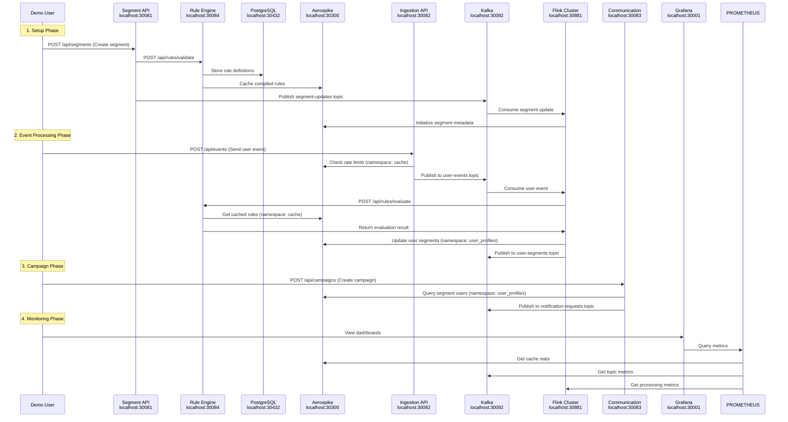

# Demo Deployment Guide - Component Interactions and Endpoints

## 🎯 Complete Component Overview

This guide explains how all components in the demo environment work together, what endpoints are available, and how they interact within the 8GB Kubernetes cluster.

## 🏗️ Component Architecture and Resource Logic

### Resource Allocation Logic Explained

The 8GB total memory is allocated based on **component criticality** and **expected workload** in a demo environment:

#### **Tier 1: Data Layer (3.5GB - 43.75%)**
These components are the foundation and need guaranteed memory:
- **Aerospike (1GB)**: Primary cache and user data store
  - *Logic*: Handles all caching, session data, and user profiles. Needs substantial memory for in-memory storage across 3 namespaces
- **Kafka + Zookeeper (1.5GB)**: Message streaming backbone
  - *Logic*: Kafka needs memory for message buffering and partition management. Critical for all async communication
- **PostgreSQL (512MB)**: Metadata persistence
  - *Logic*: Lightweight allocation since demo data volume is small, but needs enough for connection pooling and buffer cache
- **Flink TaskManager (1.5GB)**: Stream processing engine with integrated rule engine
  - *Logic*: Increased allocation to handle both stream processing and rule evaluation. Eliminates separate Rule Engine service for better performance

#### **Tier 2: Application Layer (1.5GB - 18.75%)**
Equal allocation for simplicity and balanced demo performance:
- **Segment API (512MB)**: CRUD operations, moderate load
- **Ingestion API (512MB)**: High throughput event processing
- **Communication API (512MB)**: Campaign processing and email handling

**Note**: Rule Engine functionality integrated into Flink TaskManager for optimal performance and reduced complexity.

#### **Tier 3: Infrastructure Layer (1.5GB - 18.75%)**
Supporting services with conservative allocation:
- **Flink JobManager (512MB)**: Coordination and job management
- **Prometheus (512MB)**: Metrics collection and alerting
- **Grafana (512MB)**: Dashboard rendering and visualization

#### **Tier 4: Utilities (1GB - 12.5%)**
- **Kafka UI (256MB)**: Lightweight management interface
- **System Overhead (~500MB)**: Kubernetes system pods, container runtime

## 🌐 Complete Endpoint Map

### External Access Points (via NodePort)

| Service | External URL | Internal Service | Port | Purpose | Resource |
|---------|-------------|------------------|------|---------|----------|
| **Segment Management** | http://localhost:30081 | segment-api-service:8081 | 30081 | Segment CRUD operations | 512MB |
| **Event Ingestion** | http://localhost:30082 | ingestion-api-service:8082 | 30082 | Real-time event processing | 512MB |
| **Communication** | http://localhost:30083 | communication-service:8083 | 30083 | Campaign management | 512MB |
| **PostgreSQL** | localhost:30432 | postgres-service:5432 | 30432 | Database access | 512MB |
| **Aerospike** | localhost:30300 | aerospike-service:3000 | 30300 | Cache/data access | 1GB |
| **Kafka** | localhost:30092 | kafka-service:9092 | 30092 | Message streaming | 1.5GB |
| **Flink Dashboard** | http://localhost:30881 | flink-jobmanager-service:8081 | 30881 | Stream processing + rule engine UI | 2GB |
| **Prometheus** | http://localhost:30090 | prometheus-service:9090 | 30090 | Metrics collection | 512MB |
| **Grafana** | http://localhost:30001 | grafana-service:3000 | 30001 | Monitoring dashboards | 512MB |
| **Kafka UI** | http://localhost:30080 | kafka-ui-service:8080 | 30080 | Kafka management | 256MB |

### Internal Service Discovery

All services communicate using Kubernetes DNS:

```yaml
# Internal service addresses (within cluster)
postgres-service.audience-manager-demo.svc.cluster.local:5432
aerospike-service.audience-manager-demo.svc.cluster.local:3000
kafka-service.audience-manager-demo.svc.cluster.local:29092
zookeeper-service.audience-manager-demo.svc.cluster.local:2181
flink-jobmanager-service.audience-manager-demo.svc.cluster.local:6123
prometheus-service.audience-manager-demo.svc.cluster.local:9090
grafana-service.audience-manager-demo.svc.cluster.local:3000
```

## 🔄 Component Interaction Flows

### 1. Complete Demo Workflow



### 2. Service Health Check Flow

```bash
# Health check sequence for all services
curl http://localhost:30432/                           # PostgreSQL (connection test)
curl http://localhost:30300/                           # Aerospike (info endpoint)
curl http://localhost:30092/                           # Kafka (API versions)
curl http://localhost:30881/overview                   # Flink (overview page)
curl http://localhost:30081/actuator/health           # Segment API
curl http://localhost:30082/actuator/health           # Ingestion API  
curl http://localhost:30084/actuator/health           # Rule Engine
curl http://localhost:30083/actuator/health           # Communication API
curl http://localhost:30090/-/healthy                 # Prometheus
curl http://localhost:30001/api/health                # Grafana
curl http://localhost:30080/actuator/health           # Kafka UI
```

## 📊 Data Flow and Storage Patterns

### Aerospike Namespace Usage

```yaml
# Namespace: user_profiles (400MB)
# Purpose: User-segment mappings and behavior data
# Data Pattern:
user:123 -> {
  segments: ["high_value", "electronics_buyer"],
  lastActivity: "2024-01-15T10:30:00Z",
  totalSpent: 1500.00,
  eventCount: 45
}

# Namespace: cache (400MB) 
# Purpose: Session data, rule cache, rate limiting
# Data Pattern:
rule:segment_123 -> {
  expression: "totalSpent > 1000 AND category == 'electronics'",
  compiled: <compiled_rule_object>,
  lastUsed: "2024-01-15T10:30:00Z"
}
session:abc123 -> {
  userId: "user123",
  created: "2024-01-15T10:00:00Z",
  lastAccess: "2024-01-15T10:30:00Z"
}
ratelimit:api:user123 -> {
  count: 45,
  window: "2024-01-15T10:00:00Z"
}

# Namespace: analytics (200MB)
# Purpose: Real-time aggregations and metrics  
# Data Pattern:
segment:high_value:count -> 1250
segment:high_value:daily_growth -> 15
event:purchase:hourly -> 342
```

### PostgreSQL Schema Pattern

```sql
-- Segments table
CREATE TABLE segments (
    id VARCHAR(50) PRIMARY KEY,
    name VARCHAR(255) NOT NULL,
    type VARCHAR(50) NOT NULL,
    rules JSONB NOT NULL,
    active BOOLEAN DEFAULT true,
    created_at TIMESTAMP DEFAULT NOW(),
    updated_at TIMESTAMP DEFAULT NOW()
);

-- Rules table  
CREATE TABLE rules (
    id VARCHAR(50) PRIMARY KEY,
    segment_id VARCHAR(50) REFERENCES segments(id),
    name VARCHAR(255) NOT NULL,
    expression TEXT NOT NULL,
    type VARCHAR(50) NOT NULL,
    priority INTEGER DEFAULT 0,
    active BOOLEAN DEFAULT true,
    created_at TIMESTAMP DEFAULT NOW(),
    updated_at TIMESTAMP DEFAULT NOW()
);

-- Campaigns table
CREATE TABLE campaigns (
    id VARCHAR(50) PRIMARY KEY,
    name VARCHAR(255) NOT NULL,
    segment_id VARCHAR(50) REFERENCES segments(id),
    type VARCHAR(50) NOT NULL,
    content JSONB NOT NULL,
    status VARCHAR(50) DEFAULT 'draft',
    scheduled_at TIMESTAMP,
    created_at TIMESTAMP DEFAULT NOW(),
    updated_at TIMESTAMP DEFAULT NOW()
);
```

### Kafka Topic Structure

```yaml
# Topic: user-events (2 partitions, 1 replica)
# Message format:
{
  "eventId": "evt_123456",
  "userId": "user_123", 
  "eventType": "purchase",
  "timestamp": "2024-01-15T10:30:00Z",
  "properties": {
    "amount": 149.99,
    "category": "electronics",
    "productId": "prod_789"
  },
  "context": {
    "sessionId": "sess_abc123",
    "userAgent": "Mozilla/5.0...",
    "ipAddress": "192.168.1.100"
  }
}

# Topic: segment-updates (2 partitions, 1 replica)  
# Message format:
{
  "segmentId": "segment_123",
  "action": "created|updated|deleted",
  "segment": {
    "id": "segment_123",
    "name": "High Value Users",
    "rules": {...},
    "active": true
  },
  "timestamp": "2024-01-15T10:30:00Z"
}

# Topic: user-segments (2 partitions, 1 replica)
# Message format:
{
  "userId": "user_123",
  "segmentId": "segment_123", 
  "action": "added|removed",
  "reason": "rule_evaluation|manual|expired",
  "timestamp": "2024-01-15T10:30:00Z",
  "metadata": {
    "ruleScore": 0.95,
    "evaluationLatency": 23
  }
}

# Topic: notification-requests (2 partitions, 1 replica)
# Message format:
{
  "campaignId": "campaign_123",
  "userId": "user_123",
  "type": "email|sms|push",
  "template": "welcome_high_value",
  "personalization": {
    "firstName": "John",
    "totalSpent": 1500.00
  },
  "timestamp": "2024-01-15T10:30:00Z"
}
```

## 🎮 Complete Demo Testing Guide

### Step 1: Infrastructure Verification

```bash
# 1. Verify all pods are running
kubectl get pods -n audience-manager-demo

# Expected output:
# NAME                               READY   STATUS    RESTARTS   AGE
# postgres-xxxx                      1/1     Running   0          5m
# aerospike-xxxx                     1/1     Running   0          5m  
# zookeeper-xxxx                     1/1     Running   0          5m
# kafka-xxxx                         1/1     Running   0          4m
# flink-jobmanager-xxxx              1/1     Running   0          4m
# flink-taskmanager-xxxx             1/1     Running   0          4m
# prometheus-xxxx                    1/1     Running   0          3m
# grafana-xxxx                       1/1     Running   0          3m
# kafka-ui-xxxx                      1/1     Running   0          3m

# 2. Verify resource usage
kubectl top pods -n audience-manager-demo

# Expected output should show memory usage close to allocated limits
```

### Step 2: Service Connectivity Testing

```bash
# Test all external endpoints
echo "Testing Segment API..."
curl -s http://localhost:30081/actuator/health | jq .

echo "Testing PostgreSQL..."
pg_isready -h localhost -p 30432 -U postgres

echo "Testing Aerospike..."
curl -s http://localhost:30300/ || echo "Aerospike running (no HTTP endpoint)"

echo "Testing Kafka..."
curl -s http://localhost:30080/actuator/health | jq .

echo "Testing Flink..."
curl -s http://localhost:30881/overview | grep -o "Available Task Slots"

echo "Testing Grafana..."
curl -s http://localhost:30001/api/health | jq .

echo "Testing Prometheus..."
curl -s http://localhost:30090/-/healthy
```

### Step 3: End-to-End Demo Flow

```bash
# 1. Create a demo segment
SEGMENT_RESPONSE=$(curl -s -X POST http://localhost:30081/api/segments \
  -H "Content-Type: application/json" \
  -d '{
    "name": "Demo VIP Users",
    "type": "DYNAMIC", 
    "rules": {
      "conditions": [
        {"field": "totalSpent", "operator": "gt", "value": 1000}
      ]
    }
  }')
echo "Segment created: $SEGMENT_RESPONSE"

# 2. Send demo events
for i in {1..10}; do
  EVENT_RESPONSE=$(curl -s -X POST http://localhost:30082/api/events \
    -H "Content-Type: application/json" \
    -d "{
      \"userId\": \"demo-user-$i\",
      \"eventType\": \"purchase\",
      \"properties\": {
        \"amount\": $((RANDOM % 2000 + 500)),
        \"category\": \"electronics\"
      }
    }")
  echo "Event $i sent: $EVENT_RESPONSE"
  sleep 0.5
done

# 3. Wait for processing and check results
sleep 10
curl -s http://localhost:30084/api/users/demo-user-1/segments | jq .

# 4. Check monitoring metrics
open http://localhost:30001/d/demo-overview
open http://localhost:30080/ui/clusters/demo-cluster/topics
open http://localhost:30881/#/overview
```

## 🚨 Resource Monitoring and Alerting

### Critical Resource Thresholds

```yaml
# Memory usage alerts (implement in Prometheus)
- alert: HighMemoryUsage
  expr: (container_memory_usage_bytes / container_spec_memory_limit_bytes) > 0.9
  for: 2m
  labels:
    severity: warning
  annotations:
    summary: "Pod {{ $labels.pod }} memory usage above 90%"

- alert: PodCrashLooping  
  expr: rate(kube_pod_container_status_restarts_total[5m]) > 0
  for: 1m
  labels:
    severity: critical
  annotations:
    summary: "Pod {{ $labels.pod }} is crash looping"

- alert: KafkaConsumerLag
  expr: kafka_consumer_lag_sum > 1000
  for: 5m
  labels:
    severity: warning
  annotations:
    summary: "Kafka consumer lag is high"
```

### Performance Monitoring Queries

```promql
# Memory usage by pod
sum(container_memory_usage_bytes{namespace="audience-manager-demo"}) by (pod)

# CPU usage by pod  
sum(rate(container_cpu_usage_seconds_total{namespace="audience-manager-demo"}[5m])) by (pod)

# Kafka message rate
sum(rate(kafka_server_brokertopicmetrics_messagesinpersec_count[5m])) by (topic)

# Flink processing rate
sum(rate(flink_taskmanager_job_task_operator_numRecordsInPerSecond[5m])) by (job_name)

# API request rate
sum(rate(http_requests_total{namespace="audience-manager-demo"}[5m])) by (service)
```

This demo environment provides a complete, production-like experience within the constraints of a single 8GB development machine, showcasing all the capabilities of the Audience Manager platform! 🎯