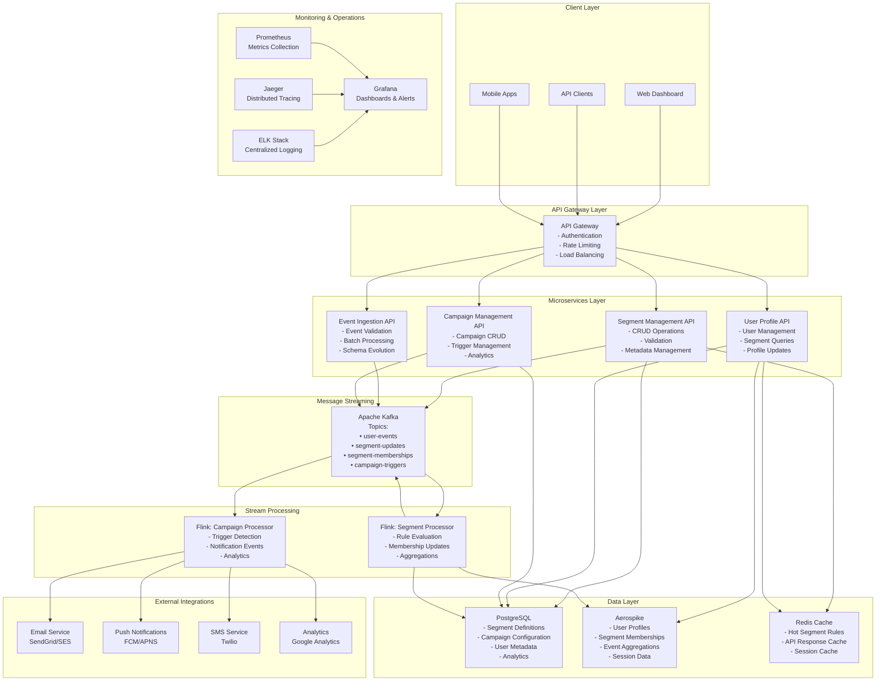
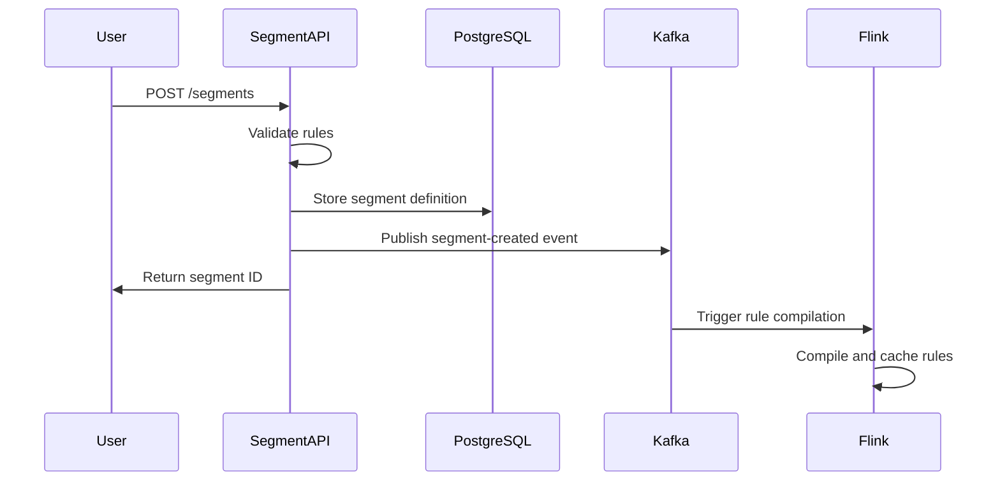
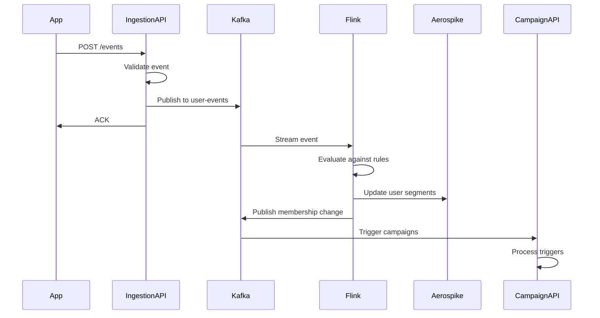
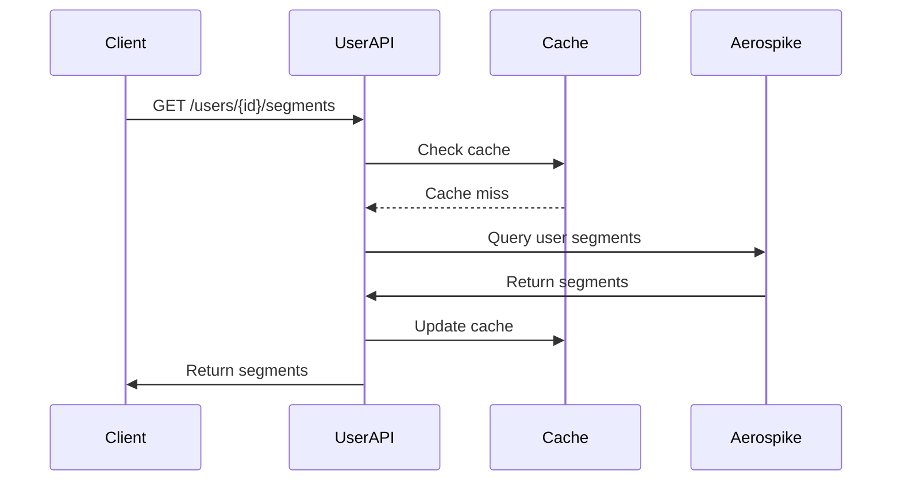
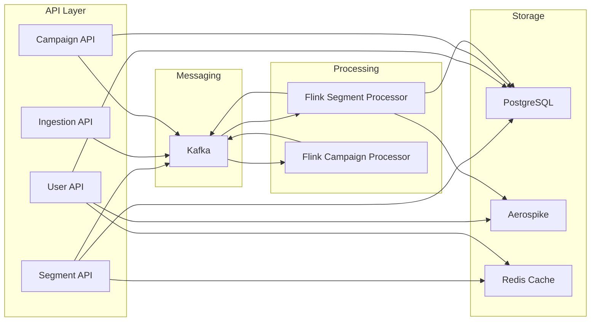

# Audience Manager Platform - High-Level Design

## 1. System Overview

The Audience Manager Platform is a distributed, real-time audience segmentation system that enables marketing teams to define, manage, and activate audience segments through sophisticated rule-based targeting. The platform processes high-volume user events, evaluates complex boolean logic rules against user behavior, maintains user-segment mappings, and enables targeted communication campaigns.

### Key Capabilities
- **Real-time Segment Management**: Define independent and derived audience segments with complex rules
- **Event-driven Processing**: Process user events in real-time for segment evaluation
- **Scalable Architecture**: Distributed microservices with horizontal scaling capabilities
- **Low-latency Queries**: Sub-second response times for segment membership queries
- **Campaign Integration**: Trigger marketing campaigns based on segment membership

## 2. Functional Requirements

### 2.1 Segment Management
- **FR1**: Create independent segments based on event attributes (count, sum) with time windows
- **FR2**: Create derived segments by combining independent segments with logical operators (AND, OR)
- **FR3**: Update existing segment definitions and rules
- **FR4**: Activate/deactivate segments without deletion
- **FR5**: Delete segments with dependency validation
- **FR6**: Query segment details and membership statistics

### 2.2 Event Processing
- **FR7**: Ingest user events in real-time from multiple sources
- **FR8**: Validate event types (clicks, installs, orders, addToCart)
- **FR9**: Aggregate event data over configurable time windows (1-1440 minutes)
- **FR10**: Evaluate segment rules against incoming events
- **FR11**: Update user-segment mappings in real-time

### 2.3 User Management
- **FR12**: Maintain user profiles with segment memberships
- **FR13**: Query user segment memberships by user ID
- **FR14**: Track segment entry/exit timestamps
- **FR15**: Provide segment membership history

### 2.4 Campaign Integration
- **FR16**: Trigger notifications when users enter/exit segments
- **FR17**: Support multiple communication channels (email, push, SMS)
- **FR18**: Batch campaign execution for derived segments
- **FR19**: Campaign history and analytics

## 3. Non-Functional Requirements

### 3.1 Performance
- **NFR1**: Support 100,000+ events per second ingestion
- **NFR2**: Sub-100ms response time for segment membership queries
- **NFR3**: Process segment evaluation within 1 second of event ingestion
- **NFR4**: Support 10,000+ concurrent segment definitions

### 3.2 Scalability
- **NFR5**: Horizontal scaling of all microservices
- **NFR6**: Auto-scaling based on load metrics
- **NFR7**: Support for multi-region deployment
- **NFR8**: Handle 100M+ user profiles

### 3.3 Availability
- **NFR9**: 99.9% uptime for core services
- **NFR10**: Zero-downtime deployments
- **NFR11**: Automatic failover for critical components
- **NFR12**: Data replication across availability zones

### 3.4 Data Consistency
- **NFR13**: Eventually consistent segment memberships
- **NFR14**: Strong consistency for segment definitions
- **NFR15**: Transactional integrity for critical operations
- **NFR16**: Data retention policies (1 year default)

### 3.5 Security
- **NFR17**: API authentication and authorization
- **NFR18**: Data encryption at rest and in transit
- **NFR19**: Audit logging for all operations
- **NFR20**: GDPR compliance for user data

## 4. System Entities

### 4.1 Core Entities

#### Segment
```typescript
interface Segment {
  id: UUID;
  name: string;
  description?: string;
  type: 'INDEPENDENT' | 'DERIVED';
  logicalExpression?: string; // For derived segments
  windowMinutes?: number;
  active: boolean;
  createdAt: timestamp;
  updatedAt: timestamp;
  rules?: SegmentRule[];
  dependencies?: SegmentDependency[];
}
```

#### SegmentRule (for Independent Segments)
```typescript
interface SegmentRule {
  id: UUID;
  segmentId: UUID;
  eventType: 'clicks' | 'installs' | 'orders' | 'addToCart';
  attribute: 'count' | 'sum';
  operator: 'GT' | 'LT' | 'EQ' | 'GTE' | 'LTE' | 'NEQ';
  value: number;
  windowMinutes: number;
  active: boolean;
  createdAt: timestamp;
}
```

#### SegmentDependency (for Derived Segments)
```typescript
interface SegmentDependency {
  id: UUID;
  derivedSegmentId: UUID;
  independentSegmentId: UUID;
  logicalOperator: 'AND' | 'OR';
  createdAt: timestamp;
}
```

#### UserEvent
```typescript
interface UserEvent {
  userId: string;
  eventType: 'clicks' | 'installs' | 'orders' | 'addToCart';
  timestamp: timestamp;
  attributes: Record<string, any>;
  sessionId?: string;
  deviceId?: string;
}
```

#### UserSegmentMapping
```typescript
interface UserSegmentMapping {
  userId: string;
  segmentId: UUID;
  enteredAt: timestamp;
  exitedAt?: timestamp;
  isActive: boolean;
}
```

### 4.2 Supporting Entities

#### Campaign
```typescript
interface Campaign {
  id: UUID;
  name: string;
  segmentId: UUID;
  channelType: 'email' | 'push' | 'sms';
  template: string;
  status: 'ACTIVE' | 'PAUSED' | 'COMPLETED';
  scheduledAt?: timestamp;
  createdAt: timestamp;
}
```

#### User
```typescript
interface User {
  id: string;
  email?: string;
  phone?: string;
  deviceTokens?: string[];
  attributes: Record<string, any>;
  createdAt: timestamp;
  lastActiveAt: timestamp;
}
```

## 5. System Architecture

### 5.1 High-Level Architecture



### 5.2 Component Details

#### 5.2.1 API Gateway
- **Technology**: Kong, Istio, or AWS API Gateway
- **Responsibilities**: 
  - Request routing and load balancing
  - Authentication and authorization
  - Rate limiting and throttling
  - Request/response transformation
  - Monitoring and analytics

#### 5.2.2 Segment Management API
- **Technology**: Spring Boot, Java 11
- **Responsibilities**:
  - Segment CRUD operations
  - Rule validation and compilation
  - Dependency management
  - Metadata management
- **Database**: PostgreSQL for persistence
- **Cache**: Redis for hot segment rules

#### 5.2.3 Event Ingestion API
- **Technology**: Spring Boot with Kafka Producer
- **Responsibilities**:
  - Event validation and normalization
  - Batch processing for high throughput
  - Schema evolution support
  - Dead letter queue handling
- **Output**: Kafka topics (user-events)

#### 5.2.4 Stream Processing (Apache Flink)
- **Segment Processor Job**:
  - Consumes user events from Kafka
  - Evaluates events against segment rules
  - Updates user-segment mappings in Aerospike
  - Publishes membership changes to Kafka

- **Campaign Processor Job**:
  - Monitors segment membership changes
  - Triggers campaign notifications
  - Handles campaign scheduling and batching
  - Publishes to external systems

#### 5.2.5 Data Storage
- **PostgreSQL**: OLTP workloads, segment definitions, campaigns
- **Aerospike**: Real-time user profiles and segment memberships
- **Redis**: Application cache and session storage

## 6. Data Flow

### 6.1 Segment Creation Flow


### 6.2 Event Processing Flow


### 6.3 Segment Query Flow


## 7. Component Interactions

### 7.1 Service Dependencies


### 7.2 Data Consistency Model

#### Strong Consistency
- Segment definitions (PostgreSQL ACID)
- Campaign configurations
- User authentication data

#### Eventual Consistency
- User segment memberships (Aerospike)
- Event aggregations
- Analytics data

#### Cache Coherence
- Cache invalidation on segment updates
- TTL-based expiration for user data
- Write-through caching for hot data

## 8. Scalability Considerations

### 8.1 Horizontal Scaling
- **API Services**: Stateless microservices behind load balancer
- **Kafka**: Partitioned topics for parallel processing
- **Flink**: Task parallelism and slot sharing
- **Aerospike**: Distributed hash-based partitioning
- **PostgreSQL**: Read replicas and connection pooling

### 8.2 Data Partitioning
- **User Events**: Partitioned by user ID hash
- **Segment Memberships**: Partitioned by user ID
- **Campaigns**: Partitioned by segment ID

### 8.3 Caching Strategy
- **L1 Cache**: Application-level (JVM heap)
- **L2 Cache**: Redis cluster
- **L3 Cache**: CDN for static content

## 9. Security Architecture

### 9.1 Authentication & Authorization
- **API Authentication**: JWT tokens with RSA signatures
- **Service-to-Service**: mTLS certificates
- **Database Access**: Connection pooling with credentials rotation

### 9.2 Data Protection
- **Encryption at Rest**: AES-256 for sensitive data
- **Encryption in Transit**: TLS 1.3 for all communications
- **PII Handling**: Data anonymization and pseudonymization

### 9.3 Compliance
- **GDPR**: Right to erasure, data portability
- **CCPA**: Consumer privacy rights
- **Audit Logging**: Immutable audit trail

## 10. Disaster Recovery

### 10.1 Backup Strategy
- **PostgreSQL**: Continuous WAL archiving + daily full backups
- **Aerospike**: Cross-datacenter replication
- **Configuration**: Git-based infrastructure as code

### 10.2 Recovery Procedures
- **RTO**: 15 minutes for critical services
- **RPO**: 5 minutes for transactional data
- **Failover**: Automated with health checks

## 11. Monitoring & Observability

### 11.1 Metrics Collection
- **Business Metrics**: Segment membership counts, event rates
- **Technical Metrics**: Latency, throughput, error rates
- **Infrastructure Metrics**: CPU, memory, disk usage

### 11.2 Alerting Strategy
- **Critical**: Service outages, data corruption
- **Warning**: Performance degradation, capacity issues
- **Info**: Deployment notifications, configuration changes

### 11.3 Distributed Tracing
- **Request Correlation**: End-to-end trace correlation
- **Performance Analysis**: Bottleneck identification
- **Error Investigation**: Root cause analysis

## 12. API Design

### 12.1 RESTful Endpoints

#### Segment Management
```
POST   /api/v1/segments              - Create segment
GET    /api/v1/segments              - List segments
GET    /api/v1/segments/{id}         - Get segment details
PUT    /api/v1/segments/{id}         - Update segment
DELETE /api/v1/segments/{id}         - Delete segment
PATCH  /api/v1/segments/{id}/status  - Activate/deactivate
```

#### Event Ingestion
```
POST   /api/v1/events                - Ingest events (batch)
POST   /api/v1/events/single         - Ingest single event
GET    /api/v1/events/health         - Health check
```

#### User Profiles
```
GET    /api/v1/users/{id}/segments   - Get user segments
GET    /api/v1/users/{id}/profile    - Get user profile
PUT    /api/v1/users/{id}/profile    - Update user profile
```

#### Campaign Management
```
POST   /api/v1/campaigns             - Create campaign
GET    /api/v1/campaigns             - List campaigns
PUT    /api/v1/campaigns/{id}        - Update campaign
POST   /api/v1/campaigns/{id}/trigger - Trigger campaign
```

### 12.2 WebSocket Endpoints
```
WS     /ws/segments/{id}/realtime    - Real-time segment updates
WS     /ws/users/{id}/segments       - Real-time user segment changes
```

## 13. Error Handling

### 13.1 Error Response Format
```json
{
  "error": {
    "code": "VALIDATION_ERROR",
    "message": "Invalid segment rule configuration",
    "details": {
      "field": "rules[0].value",
      "reason": "Value must be greater than 0"
    },
    "timestamp": "2025-01-07T10:30:00Z",
    "traceId": "abc123-def456"
  }
}
```

### 13.2 Error Categories
- **Client Errors (4xx)**: Validation, authentication, authorization
- **Server Errors (5xx)**: System failures, timeouts, dependencies
- **Business Errors**: Domain-specific validation failures

## 14. Performance Benchmarks

### 14.1 Target Metrics
- **Event Ingestion**: 100K events/second
- **Segment Evaluation**: <1 second latency
- **User Query**: <100ms p99 latency
- **Segment Creation**: <500ms latency

### 14.2 Load Testing
- **Scenarios**: Peak traffic, sustained load, spike testing
- **Tools**: JMeter, Gatling, custom load generators
- **Monitoring**: Real-time metrics during testing

## 15. Future Enhancements

### 15.1 Machine Learning Integration
- **Predictive Segments**: ML-based user behavior prediction
- **Automated Optimization**: Self-tuning segment rules
- **Anomaly Detection**: Unusual pattern identification

### 15.2 Advanced Features
- **Segment A/B Testing**: Experimental segment variants
- **Real-time Personalization**: Dynamic content adaptation
- **Cross-platform Identity**: Unified user tracking

### 15.3 Platform Evolution
- **Multi-tenancy**: SaaS platform capabilities
- **Global Distribution**: Multi-region deployment
- **Event Sourcing**: Complete audit trail with replay capability

---

This High-Level Design serves as the comprehensive blueprint for the Audience Manager Platform, ensuring scalability, reliability, and maintainability for enterprise-scale audience segmentation and campaign management.