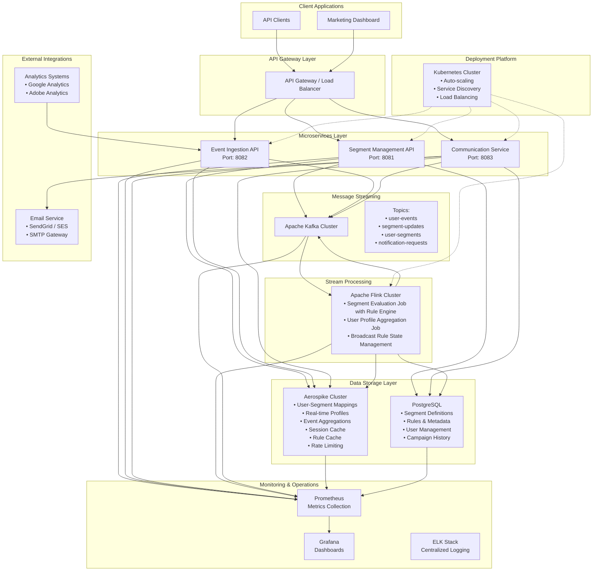
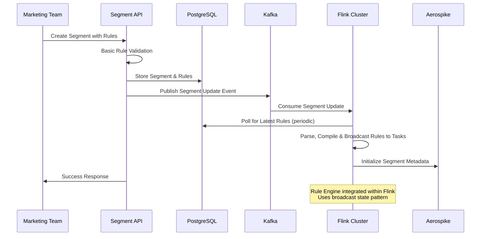
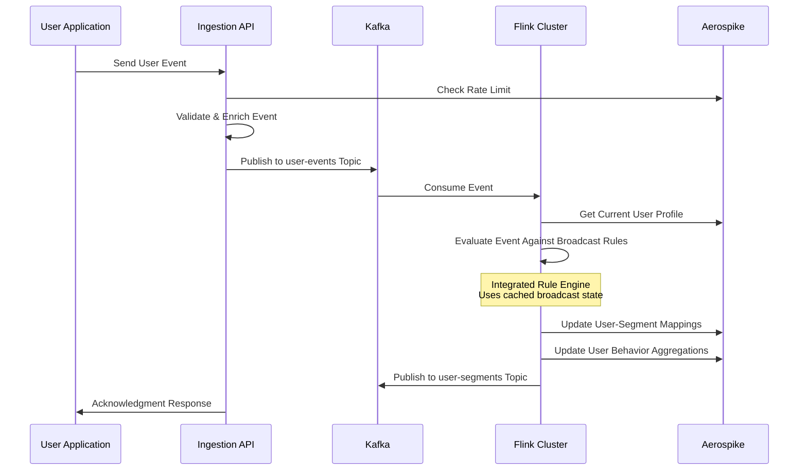
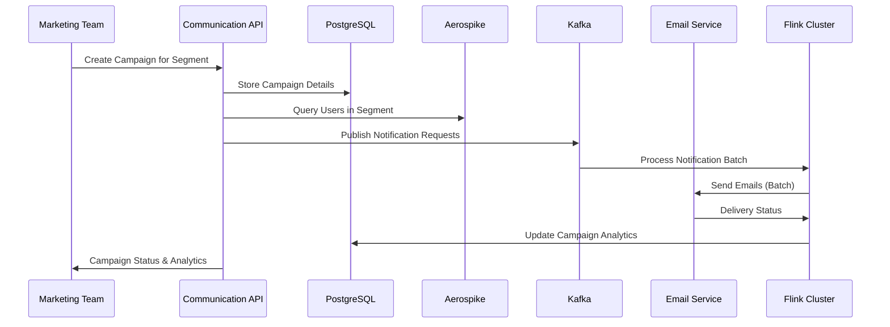
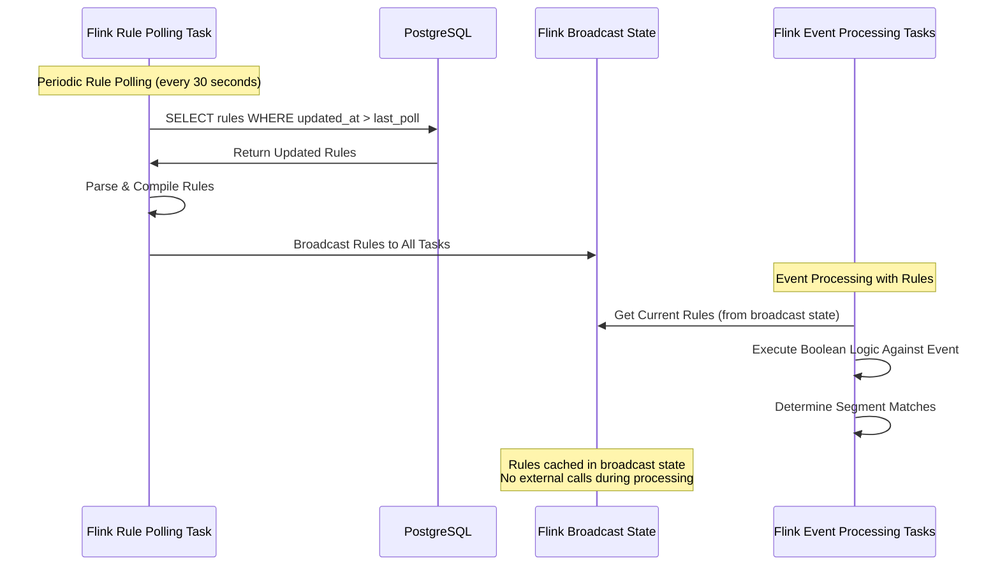
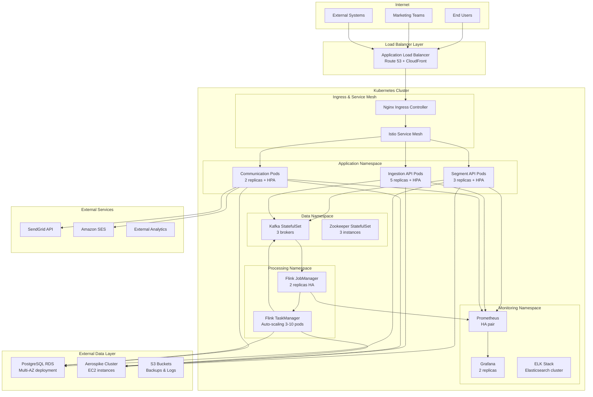

# System Architecture - Audience Manager Platform

## System Overview

The Audience Manager Platform is a comprehensive, distributed real-time audience segmentation system that empowers marketing teams to define, manage, and activate audience segments through sophisticated rule-based targeting. The platform processes high-volume user events in real-time, evaluates complex boolean logic rules against user behavior, maintains up-to-date user-segment mappings in low-latency storage, and enables targeted communication campaigns. Built on a microservices architecture with event-driven processing, the system ensures scalability, fault tolerance, and sub-second response times for both segment evaluation and user profile queries.

## Architecture Diagram



## Core Components

### 1. Segment Management API (Port: 8081)
**Purpose**: Comprehensive management of audience segments, rules, and metadata operations

**Responsibilities**:
- CRUD operations for audience segments and static rules
- Segment lifecycle management (create, activate, deactivate, archive)
- Rule definition storage and basic validation
- Real-time segment statistics and performance metrics
- User management and access control
- Segment template management and versioning
- Audit trail for compliance and governance

**Technology**: Spring Boot 3.2 with JPA/Hibernate, PostgreSQL integration
**Scalability**: Horizontal scaling with load balancer, database connection pooling

### 2. Event Ingestion API (Port: 8082)
**Purpose**: High-throughput, fault-tolerant ingestion of user behavioral events

**Responsibilities**:
- REST endpoint for real-time event ingestion (page views, purchases, clicks)
- Event validation, sanitization, and enrichment with metadata
- Publish validated events to Kafka with guaranteed delivery
- Rate limiting and throttling per client/API key
- Event replay capabilities for data recovery
- Schema evolution and backwards compatibility
- Integration with external analytics systems

**Technology**: Spring Boot with Kafka Producer, Aerospike for rate limiting
**Scalability**: Auto-scaling based on throughput, partitioned Kafka publishing

### 3. Communication Service (Port: 8083)
**Purpose**: Multi-channel communication and campaign management for audience segments

**Responsibilities**:
- Send targeted communications (email, SMS, push notifications) to segment users
- Campaign creation and scheduling with marketing teams
- Template management and personalization
- Delivery tracking and analytics (open rates, click-through rates)
- Unsubscribe management and compliance (GDPR, CAN-SPAM)
- Integration with external communication providers (SendGrid, SES, Twilio)
- Batch processing for large segment communications

**Technology**: Spring Boot with async processing, external email/SMS APIs
**Scalability**: Queue-based processing, batch optimization for large segments

### 4. Stream Processing Layer (Apache Flink Cluster)
**Purpose**: Real-time event processing, rule evaluation, and segment assignment at scale

**Components**:
- **Segment Evaluation Job with Integrated Rule Engine**: Applies rules to incoming events, assigns users to segments
- **User Profile Aggregation Job**: Maintains real-time user behavior aggregations
- **Segment Statistics Job**: Computes segment size and performance metrics
- **Rule Broadcast Task**: Periodically polls PostgreSQL and broadcasts rule updates to all parallel tasks

**Responsibilities**:
- Consume user events from Kafka topics with exactly-once semantics
- Integrated rule evaluation with complex boolean logic processing (AND, OR, NOT operators)
- Support for nested conditions and attribute-based rule evaluation
- Broadcast state management for rule distribution across all parallel tasks
- Periodic rule polling from PostgreSQL database
- Update user-segment mappings in Aerospike with sub-second latency
- Maintain user behavior aggregations (page views, purchase history, etc.)
- Handle rule changes and segment updates dynamically
- Checkpointing and state recovery for fault tolerance
- Rule compilation and optimization for performance

**Technology**: Apache Flink 1.17 with RocksDB state backend, Kafka connectors, Broadcast State Pattern
**Scalability**: Distributed processing with multiple TaskManagers, auto-scaling, broadcast state for rules

### 5. Data Storage Architecture

#### PostgreSQL (Primary Metadata Store)
**Purpose**: ACID-compliant storage for structured data
- Segment definitions, rules, and complex boolean expressions
- User management, roles, and permissions
- Campaign history and audit logs
- Rule versioning and change history
- Marketing team workspace management

**Configuration**: Master-slave replication, connection pooling, query optimization

#### Aerospike Cluster (High-Performance User Store & Cache)
**Purpose**: Sub-millisecond storage for all user data and caching needs
- Real-time user-segment assignments with TTL management
- User behavior aggregations and computed attributes
- Session state and real-time counters
- API response caching and rate limiting state
- Real-time leaderboards and counters
- Cross-datacenter replication for global access
- Memory-optimized storage with SSD persistence

**Configuration**: Multi-node cluster with multiple namespaces:
- `user_profiles`: User-segment mappings and behavior data
- `cache`: Session data, API cache, rate limiting counters
- `analytics`: Real-time aggregations and computed metrics

**Note**: Rule caching is now handled by Flink's broadcast state pattern for optimal performance.

## Data Flow Architecture

### 1. Segment Creation & Rule Management Flow


### 2. Real-time Event Processing & Segment Assignment Flow


### 3. Communication Campaign Flow


### 4. Integrated Rule Engine Flow within Flink


## Scalability & Fault Tolerance

### Horizontal Scaling Strategies
- **API Services**: Auto-scaling with Kubernetes HPA based on CPU/memory/request metrics
- **Kafka Cluster**: Multi-broker setup with automatic partition rebalancing
- **Flink Cluster**: Dynamic TaskManager scaling based on backpressure and throughput
- **Aerospike Cluster**: Linear scaling with consistent hashing and automatic data rebalancing across multiple namespaces
- **PostgreSQL**: Read replicas for query scaling, connection pooling with PgBouncer

### Partitioning & Distribution Strategy
- **Kafka Topics**: Partition by user ID hash for ordered processing and load distribution
- **Flink**: KeyBy operations on user ID for stateful operations and parallel processing
- **Aerospike**: Consistent hashing across cluster nodes with configurable replication factor
- **Database Sharding**: Horizontal sharding by user ID ranges for large-scale deployments

### Fault Tolerance Mechanisms
- **Flink Checkpointing**: RocksDB state backend with S3/HDFS for state recovery
- **Kafka Replication**: Min 3 replicas with acks=all for durability
- **Aerospike Cross-DC Replication**: Multi-datacenter deployment for disaster recovery
- **Database HA**: PostgreSQL streaming replication with automatic failover
- **Circuit Breakers**: Hystrix/Resilience4j for service-to-service communication
- **Dead Letter Queues**: Failed message handling with retry logic and alerting

## Non-Functional Requirements

### Performance Targets
- **Event Ingestion**: 50,000+ events/second per ingestion service instance
- **Rule Evaluation**: < 50ms for complex boolean expressions
- **Segment Assignment**: < 100ms end-to-end latency
- **API Response Time**: < 200ms for CRUD operations (95th percentile)
- **User Profile Queries**: < 5ms from Aerospike (99th percentile)
- **Communication Delivery**: 10,000+ emails/minute per service instance

### Availability & Reliability
- **System Uptime**: 99.95% (4.38 hours downtime/year)
- **Data Durability**: 99.999999999% (11 9's) with cross-datacenter replication
- **Recovery Time Objective (RTO)**: < 5 minutes for service recovery
- **Recovery Point Objective (RPO)**: < 1 minute for data loss
- **Graceful Degradation**: System operates with reduced functionality during partial failures

### Security & Compliance
- **Authentication**: OAuth 2.0/JWT with refresh token rotation
- **Authorization**: Role-based access control (RBAC) with fine-grained permissions
- **Data Encryption**: TLS 1.3 in transit, AES-256 at rest
- **PII Protection**: Data anonymization and pseudonymization capabilities
- **Audit Logging**: Complete trail for GDPR, CCPA compliance
- **API Security**: Rate limiting, IP whitelisting, API key management

## Technology Stack & Rationale

| Component | Technology | Version | Reasoning |
|-----------|------------|---------|-----------|
| **API Framework** | Spring Boot | 3.2.x | Mature ecosystem, production-ready, excellent monitoring |
| **Message Streaming** | Apache Kafka | 3.5.x | Industry standard, high throughput, exactly-once semantics |
| **Stream Processing** | Apache Flink | 1.17.x | Low latency, stateful processing, exactly-once guarantees, integrated rule engine |
| **User Store & Cache** | Aerospike | 6.4.x | Sub-millisecond latency, linear scaling, memory-optimized, multi-namespace |
| **Metadata Store** | PostgreSQL | 15.x | ACID compliance, complex queries, JSON support |
| **Container Platform** | Kubernetes | 1.28.x | Industry standard, auto-scaling, service discovery |
| **Monitoring** | Prometheus + Grafana | Latest | Kubernetes-native, rich ecosystem, alerting |
| **Service Mesh** | Istio | 1.19.x | Traffic management, security, observability |
| **Email Service** | SendGrid/Amazon SES | - | Reliable delivery, compliance, analytics |

## Deployment Architecture (Kubernetes)



### Kubernetes Deployment Specifications

#### Resource Requirements
```yaml
# Example for Segment API
resources:
  requests:
    memory: "512Mi"
    cpu: "250m"
  limits:
    memory: "1Gi"
    cpu: "500m"

# Auto-scaling configuration
hpa:
  minReplicas: 3
  maxReplicas: 10
  targetCPUUtilizationPercentage: 70
  targetMemoryUtilizationPercentage: 80
```

#### Service Discovery & Load Balancing
- **Service Mesh**: Istio for advanced traffic management, security, and observability
- **Internal Services**: Kubernetes Services with automatic DNS resolution
- **External Load Balancer**: Application Load Balancer with health checks
- **Circuit Breakers**: Envoy proxy configuration for fault tolerance

### Data Persistence Strategy
- **PostgreSQL**: Amazon RDS with Multi-AZ deployment for high availability
- **Aerospike**: Dedicated EC2 instances with EBS volumes for optimal performance across multiple namespaces
- **Kafka**: Persistent volumes with fast SSD storage
- **Backup Strategy**: Automated daily backups to S3 with cross-region replication

### Security Implementation
- **Network Policies**: Kubernetes network policies for microsegmentation
- **Pod Security**: Security contexts, read-only filesystems, non-root users
- **Secrets Management**: Kubernetes secrets with external secret operators
- **TLS**: Automatic certificate management with cert-manager and Let's Encrypt
- **RBAC**: Kubernetes role-based access control for fine-grained permissions

### Monitoring & Observability
- **Metrics**: Prometheus with custom application metrics and business KPIs
- **Logging**: Centralized logging with ELK stack and structured JSON logs
- **Tracing**: Distributed tracing with Jaeger for request flow analysis
- **Alerting**: PagerDuty integration with intelligent alert routing
- **Dashboards**: Business and technical dashboards in Grafana

### Disaster Recovery & Business Continuity
- **Multi-Region Deployment**: Active-passive setup with automatic failover
- **Data Replication**: Cross-region replication for all persistent data
- **Backup & Restore**: Automated backup procedures with point-in-time recovery
- **Chaos Engineering**: Regular disaster recovery testing with chaos engineering tools

This comprehensive architecture ensures enterprise-grade scalability, reliability, and operational excellence while maintaining the flexibility to evolve with changing business requirements.